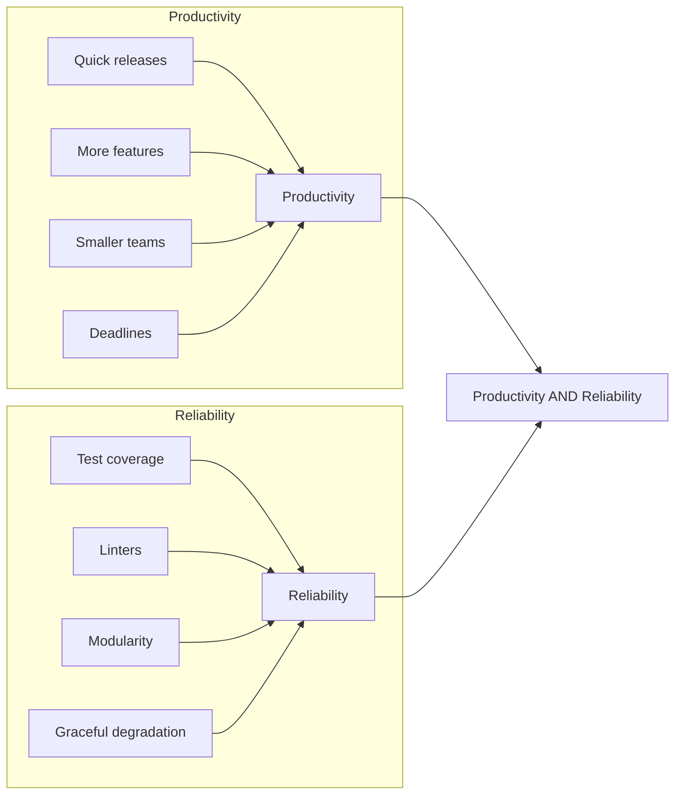
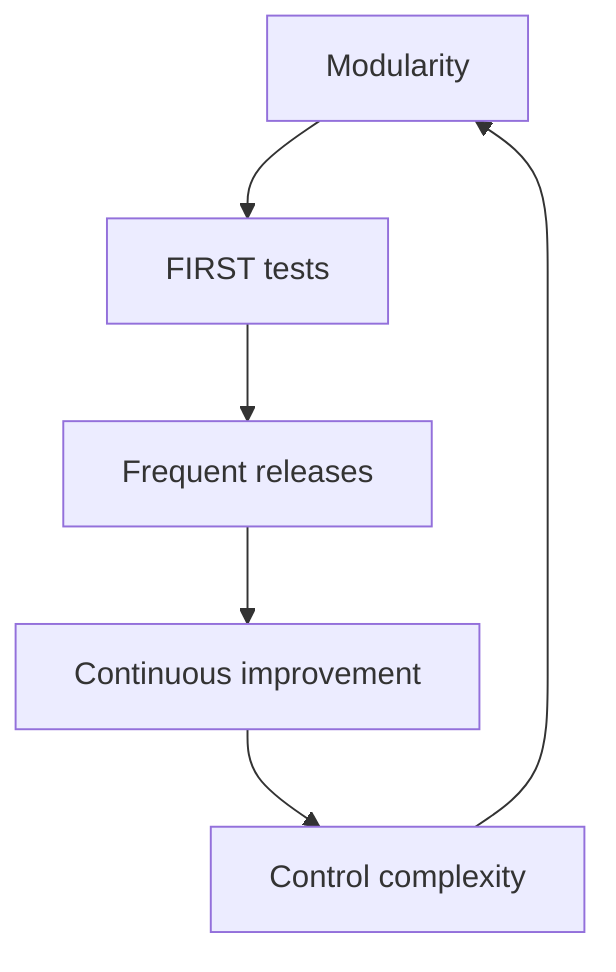

# Course transcripts

This page covers the concepts covered in the exercises

## Purpose

Build habits for productivity and reliability.

## Cycle of value

The cycle of value is a cycle of writing code, testing it, and then refactoring it to improve its quality.
This cycle keeps the code healthy and easy to maintain.
It's like brushing your teeth - do it every day to keep your teeth healthy.

## Modularity

Modularity is the practice of breaking down code into smaller pieces. This makes it easier to understand, test, and maintain.

However, cutting code arbitrarily can lead to confusion. Principles that help in a beneficial cut:

### Name by purpose

Names for files, classes, or functions should be self-evident.
A good name conveys purpose - without digging further into their code or comments.
This saves time when reading code.

### Separate by lifecycle

Keep stable code separate from evolving code.

### Avoid side effects

Side effects are changes to state - display, storage, network, etc.
They bring dependency. Isolate your logic into pure functions that return a value without changing the state.
Keep dependencies separate.

### Inject dependencies

When it isn't possible to isolate with pure functions, inject dependencies.
Pass in the dependencies as parameters, rather than hardcoding them.
This makes it easy to mock the dependencies in tests, and to swap them out in production.
